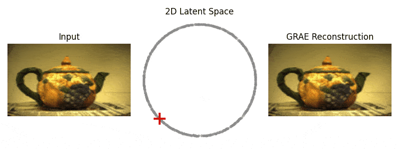

Geometry Regularized Autoencoders (GRAE)
==============================
[](https://doi.org/10.1109/TPAMI.2022.3222104)

<p align="center">

</p>

Source code for the Geometry Regularized Autoencoder paper.  Based on the paper [here](https://doi.org/10.1109/TPAMI.2022.3222104).  The traditional autoencoder objective is augmented to regularize the latent space towards a manifold learning embedding, e.g., PHATE. 
A more detailed explanation of the method can be found in `GRAE_poster.pdf`. 

## Reference
If you find this work useful, please cite:
```
@article{duque2022geometry,
  title={Geometry Regularized Autoencoders},
  author={Duque, Andres F and Morin, Sacha and Wolf, Guy and Moon, Kevin R},
  journal={IEEE Transactions on Pattern Analysis and Machine Intelligence},
  year={2022},
  publisher={IEEE}
}
```


## Install
You can install this repo directly with pip, preferably in a virtual environment : 
```
pip install --upgrade git+https://github.com/KevinMoonLab/GRAE.git
``` 
<p>

</p>

## Usage

The code largely follows the scikit-learn API to implement different autoencoders and dimensionality reduction tools. You can change basic autoencoder hyperparameters and manifold learning 
hyperparameters through the model interface. For example, to reproduce some Rotated Digits results : 
```python
from grae.models import GRAE
from grae.data import RotatedDigits

# Various autoencoder parameters can be changed
# t and knn are PHATE parameters, which are used to compute a target embedding
m = GRAE(epochs=100, n_components=2, lr=.0001, batch_size=128, t=50, knn=10)

# Input data should be an instance of grae.data.BaseDataset
# We already have subclasses for datasets in the paper
data = RotatedDigits(data_path='data', split='train')

# Fit model
m.fit(data)

# Get 2D latent coordinates
z = m.transform(data)

# Compute some image reconstructions
imgs = m.inverse_transform(z)
```
Some utility functions are available for visualization : 
```python
# Fit, transform and plot data
m.fit_plot(data)

# Transform and plot data
m.plot(data)

# Transform, inverse transform and visualize reconstructions
m.view_img_rec(data)
```
Most of our benchmarks are implemented with similar estimators. Implemented models include 
- **GRAE:** Autoencoder with a PHATE latent target;
- **GRAE (UMAP):** Autoencoder with a UMAP latent target;
- **AE:** Vanilla Autoencoder;
- **DAE:** Denoising Autoencoder;
- **CAE:** Contractive Autoencoder;
- **VAE:** β-VAE;
- **TAE:** [Topological Autoencoder](https://proceedings.mlr.press/v119/moor20a.html);
- **DiffusionNet:** [Diffusion Nets](https://www.sciencedirect.com/science/article/abs/pii/S1063520317300957).
 
And many more!
## Adding a new model or a new dataset
New models should subclass grae.models.BaseModel or grae.models.AE if autoencoder-based. New datasets should follow the grae.data.BaseDataset interface.

